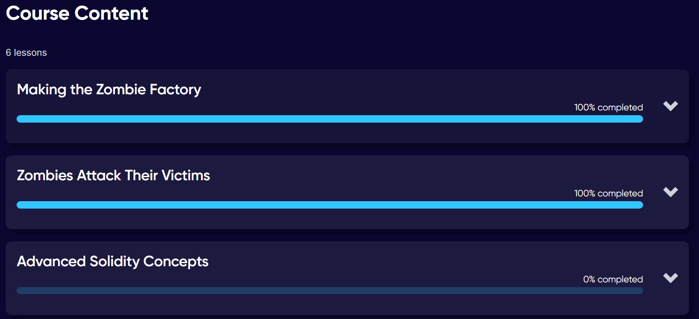

# 🧠 CryptoZombies Solidity Progress

## 📸 Progress
Completed Lessons:
- **Making the Zombie Factory** – 100%
- **Zombies Attack Their Victims** – 100%
- **Advanced Solidity Concepts** – 0%

*(Screenshot attached: )*

---

## 🧩 Summary of Learning
Through the CryptoZombies lessons, I learned the **core fundamentals of Solidity**, including how to define and manage **smart contracts**, **structs**, and **arrays**. I built functions to create and manipulate zombie data, used **mappings** and **inheritance**, and understood how **function visibility** and **modifiers** control access. Additionally, I explored how smart contracts interact and how data is stored on the blockchain using public and private variables.

---

## ❓ Difficulty / Question
1. Function Parameter Names can be Same as member variables and thats pretty confusing.

2. I found challenging was understanding **how inheritance works with multiple contracts**—specifically how derived contracts access and override parent contract functions safely.

---

